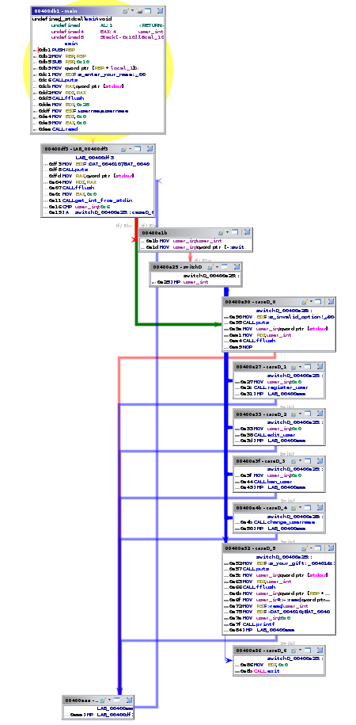

# Control Flow Graphs

So if we step back a bit, what have we been thinking about throughout this? At a high level, we've been thinking about this notion of a control flow graph.

## Quickly, what does a Control Flow Graph seem like?

If you open up Ghidra, or a decompiler, and take a look at the graph view, that is your CFG:

## Who gives us the Control Flow Graph? 

One way to think about it is that it comes from the compiler and statically. The compiler generates the CFG during program analysis, and the compiler is going to inject instrumentation at all the sites in the program that do indirect jumps. The instrumentation will consult the CFG graph somehow and will check whether a particular jump target is actually valid.

You can also try and imagine doing this CFG stuff dynamically, so for example trying to infer the CFG using a mechanism such as the Shadow stack. It is possible to implement shadow stacks at software level:

* Have compiler instrument each `call` to push the valid return address onto a software maintained shadow stack
* Have the compiler instrument for `rets` as well, to pop that software maintained shadow stack

​

## How accurate is the CFG? 

If you have inaccuracy, you can have problems which mess with Control flow integrity.

For example, if you have a under constrained control flow graph, this may cause false negatives. The control flow attack may go undetected as it's under constrained.

Let's say the legitimate CFG looks like the one on the left:

As shown by the right, an attacker's nodes, in red, can go undetected, as the CFG has been under-constrained.

It's under-constrained because it doesn't prevent all the bad control flows. In this example, the control flow from 0 to 4 shouldn't be allowed.

You can also have an over-constrained graph which will cause false positives. Having a legitimate control flow may be flagged as illegal.

As we can see, the link between 2 and 3 isn't shown - it's been marked as illegal.

So the take-away from this is that we need an accurate control flow graph, which can't be under or over constrained. If someone has too many notifications about false positives, then they'll turn off the tool to carry on with work, therefore missing potential attackers getting in.

